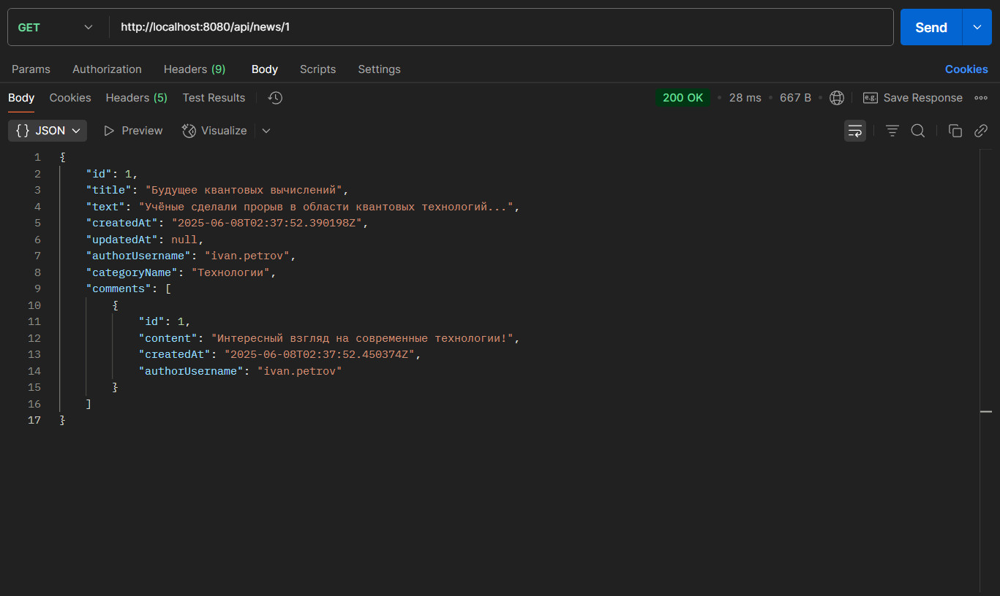
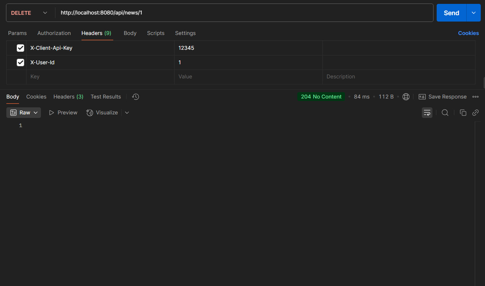

# 📰 NewsApp — REST API для новостного сервиса

##  Описание

**NewsApp** — это backend-приложение на Spring Boot, предоставляющее REST API для управления новостями, пользователями, категориями и комментариями. Поддерживает валидацию данных, защиту операций через AOP, фильтрацию и пагинацию.

---

## ⚙️ Основные возможности

-  CRUD-операции для пользователей, категорий, новостей и комментариев
-  AOP-проверка авторства (редактирование/удаление только своими)
-  Валидация DTO через `jakarta.validation`
-  Фильтрация новостей по авторам и категориям
-  Пагинация (`page`, `size`)
-  MapStruct — преобразование между Entity и DTO
-  Liquibase — миграции и инициализация базы данных

---

##  Технологии и зависимости

-  Java 21
-  Spring Boot 3.5.0
-  Spring Data JPA
-  Spring Validation
-  MapStruct 1.5.3.Final
-  Liquibase
-  PostgreSQL
-  Lombok

---

## 📁 Структура проекта

- `controller` — REST-контроллеры (User, News, Category, Comment)
- `service / impl` — Сервисный слой (интерфейсы и реализации)
- `dto / request` — DTO для входящих данных
- `dto / response` — DTO для ответов клиенту
- `entity` — JPA-сущности
- `repository / spec` — Репозитории и JPA-спецификации (фильтрация)
- `mapper` — MapStruct-мапперы
- `aop` — Аспекты и аннотации (проверка авторства)
- `exception` — Обработка ошибок и исключения
- `filter` — Фильтры (API-ключ и X-User-Id)
- `interceptors` — Перехватчики (логирование запросов)
- `scopes` — RequestScope бин `AuthenticatedUser`

---

## ✅ Требования (Requirements)

- Java 21 (JDK)
- Gradle с Kotlin DSL
- PostgreSQL 14+
- Docker и Docker Compose
- IDE с поддержкой Spring Boot (например, IntelliJ IDEA)

---

##  Установка и запуск (Setup & Run)

### 1.  Запустите PostgreSQL через Docker

```bash
   docker-compose -f docker/docker-compose.yml up -d
```

Контейнер создаёт базу `newsdb` с пользователем `islam` и паролем `1111` на порту `5433`.

### 2. ⚙️ Соберите и запустите приложение

```bash
   ./gradlew bootRun
```

Или через IDE — запустите `NewsappApplication`

Приложение будет доступно по адресу: [http://localhost:8080/api](http://localhost:8080/api)

---

## 🛠️ Liquibase (Database Migration)

Liquibase автоматически запускается при старте приложения и выполняет:

- Создание таблиц пользователей, категорий, новостей и комментариев
- Инициализацию начальными данными

Changelog-файлы находятся по пути:

```
src/main/resources/db/changelog/db.changelog-master.yaml
```

---

##  Основные конечные точки (Endpoints)
| Ресурс       | HTTP     | Путь                               | Описание                       |
| ------------ | -------- | ---------------------------------- | ------------------------------ |
| **Пользователи** | `GET`    | `/api/users?page=0&size=10`        | Получить список пользователей  |
|              | `POST`   | `/api/users`                       | Создать пользователя           |
|              | `GET`    | `/api/users/{id}`                  | Получить пользователя по ID    |
|              | `DELETE` | `/api/users/{id}`                  | Удалить пользователя           |
| **Категории**    | `GET`    | `/api/categories?page=0&size=10`   | Получить список категорий      |
|              | `POST`   | `/api/categories`                  | Создать категорию              |
|              | `GET`    | `/api/categories/{id}`             | Получить категорию по ID       |
|              | `PUT`    | `/api/categories/{id}`             | Обновить категорию             |
|              | `DELETE` | `/api/categories/{id}`             | Удалить категорию              |
| **Новости**      | `GET`    | `/api/news?page=0&size=10`         | Получить список новостей       |
|              | `GET`    | `/api/news?authorId=&categoryId=`  | Фильтрация новостей            |
|              | `GET`    | `/api/news/{id}`                   | Получить новость по ID         |
|              | `POST`   | `/api/news`                        | Создать новость                |
|              | `PUT`    | `/api/news/{id}`                   | Обновить новость               |
|              | `DELETE` | `/api/news/{id}`                   | Удалить новость                |
| **Комментарии**  | `GET`    | `/api/news/{newsId}/comments`      | Получить комментарии к новости |
|              | `POST`   | `/api/news/{newsId}/comments`      | Добавить комментарий к новости |
|              | `PUT`    | `/api/news/{newsId}/comments/{id}` | Обновить комментарий           |
|              | `DELETE` | `/api/news/{newsId}/comments/{id}` | Удалить комментарий            |


---

##  Примеры использования в Postman

### ✅ Получение новости по ID

```http
GET http://localhost:8080/api/news/1
```

- Заголовки:
    - `X-Client-Api-Key: 12345`
    - `X-User-Id: 1`



### 🗑 Удаление новости по ID

```http
DELETE http://localhost:8080/api/news/1
```

- Заголовки:
    - `X-Client-Api-Key: 12345`
    - `X-User-Id: 1`



---

## 🔐 Безопасность / Заголовки

| Заголовок           | Назначение                                 | Пример          |
|---------------------|--------------------------------------------|------------------|
| `X-Client-Api-Key`  | API-ключ клиента (проверяется фильтром)    | `12345`         |
| `X-User-Id`         | ID текущего пользователя (RequestScope бин)| `1`             |

Проверка авторства (удаление/редактирование) реализована через AOP. 

---

##  Автор

**Islam Chakhaev** 